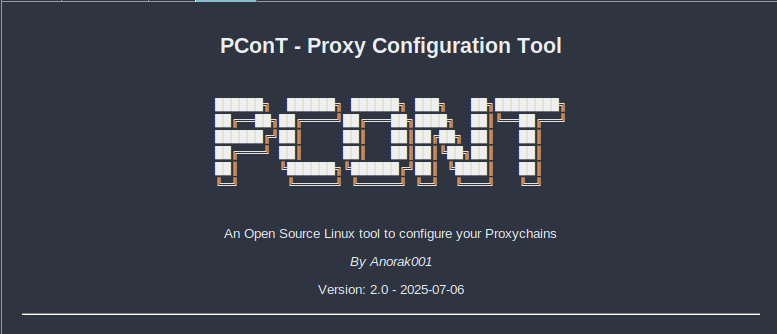

# PConT - Proxy Connection Tool

**PConT** is a powerful and flexible Proxy Connection Tool designed to automate the acquisition and management of proxies, providing seamless integration with other tools. It is built with Python and is aimed at cybersecurity enthusiasts and professionals who require an efficient way to handle proxy connections(also save a Lot of Time!!!).
 
## Features
- **Automated Proxy Acquisition**: Automatically scrape and retrieve proxies from proxyscrape API.
- **Integration Ready**: Easily integrate proxy management with your own set of tools.
- **Configurable Execution**: Configure the behavior of scripts during program execution.
- **Proxy Checker**: Automatically checks if the proxy is up ( aka Downdetector)
- **Auto-Configuration**: Tired of writing the lengthy .conf file? use this tool to get your network setup ready within seconds

## Installation:
   **1.1 Clone the repo:**
   
   ```bash
       git clone https://github.com/Anorak001/PConT.git
   ```
     
  **1.2 Change the scripts into executables:**
   ```bash
      chmod +x proxychains-setup.sh
      chmod +x proxychains-reset.sh
      chmod +x proxychains-help.sh
   ```
   **1.3 Ensure Proxychains are installed, if not run:**
   ```bash
     sudo apt install proxychains
   ```

   **1.4 Run the setup Script:**
   ```bash
   ./proxychains-setup.sh
   ```
   **1.5 If stuck, refer the docs here or:**
   ```bash
   ./proxychains-help.sh
   ```

   **1.6 Willing to reset the configuration?, run:**
   ```bash
   ./proxychains-reset.sh
   ```
**Note:** The proxies are being provided by the proxscrape.com and I dont own them, we are bringing a new feature that would mitigate this issue.I can guarrantee most of these proxies are safe (Atleast it is safer than VPN!!)
     
    

